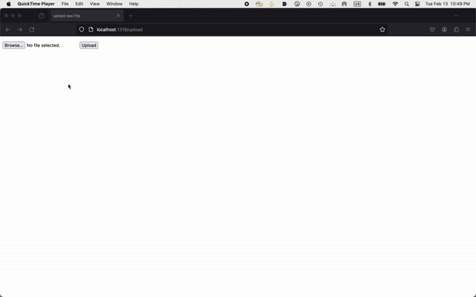

# **Flask on Docker:**



This repo is the result of following the tutorial [here](https://testdriven.io/blog/dockerizing-flask-with-postgres-gunicorn-and-nginx/), which was created by Micheal Herman. 
The end result is a flask application created through docker with 3 production environments, Postgres, Gunicorn, and Nginx. 
With this flask application you are able to upload an image and view it in a media file, such as the hello.jpeg file previewed in the upload.gif file above. It is similar 

## How it works

This project utilizes rootless Docker and specifically Docker Compose, which can be downloaded [here](https://docs.docker.com/engine/security/rootless/#install).

1. First build the images and spin up the  containers:
``` sh
$ docker-compose up -d --build
```
This builds the web folder and establishes it in the container. 
-d allows for this to happen in the background

3. Then create our database table
``` sh
$ docker-compose exec web python manage.py create_db
``` 
To check if it worked check out http://localhost:(PORT). For my work I used 1319 as my PORT. It should display 
``` sh
`{                                                                                
  "hello": "world"                
}`
```
3. Bring down the development containers (and the associated volumes with the -v flag):
``` sh
$ docker compose down -v
```
5. Then we build the file in the production server using the following command:
  ``` sh
  $ docker-compose -f docker-compose.prod.yml up -d --build
  ``` 
6. Create another table within the production server
``` sh
$ docker-compose -f docker-compose.prod.yml exec web python manage.py create_db
```
Test your flask applicatoin again at the previous localhost link. it should look like 
``` sh
{"hello": "world"}
```
6. repeat step 3 and bring the development containers down with 
``` sh
$ docker compose down -v
```

8. Lastly, Rebuild your containers
``` sh
$ docker-compose -f docker-compose.prod.yml up -d --build
$ docker-compose -f docker-compose.prod.yml exec web python manage.py create_db
```
# **results**

You can now upload an image at [http://localhost:(PORT)/upload](http://localhost:(UNIQUEPORT)/upload)

View that uploaded image at [http://localhost:(PORT)/media/IMAGE_FILE_NAME](http://localhost:(PORT)/media/IMAGE_FILE_NAME)

